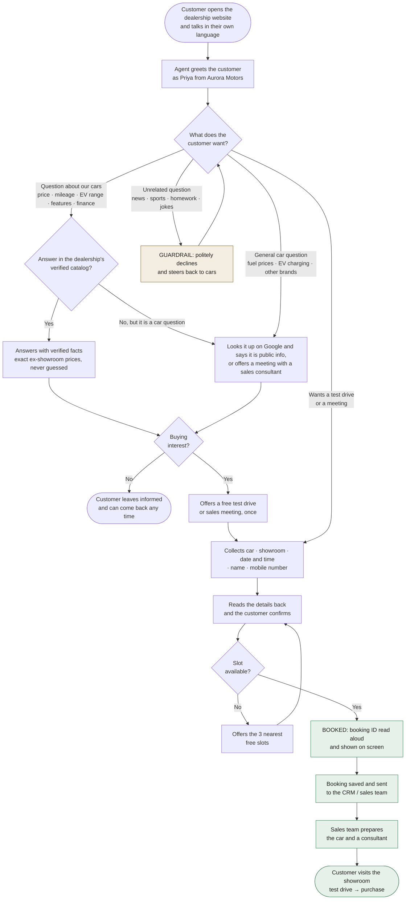
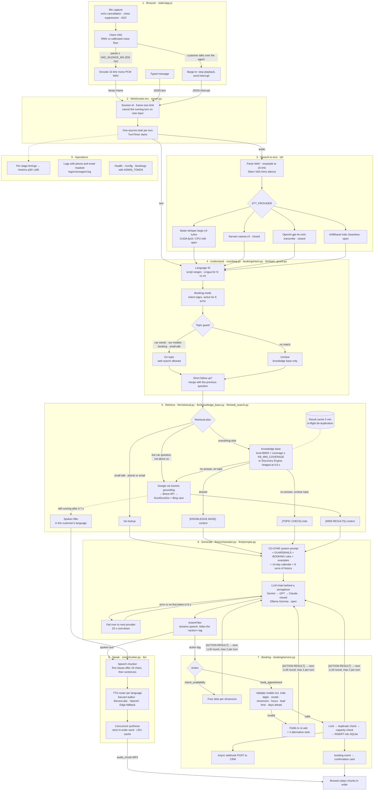
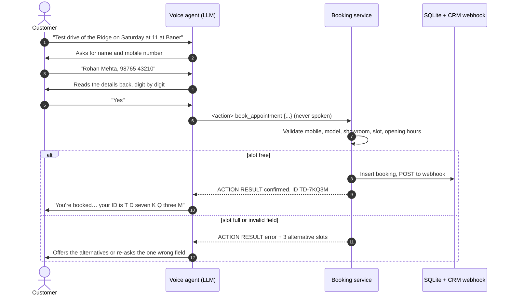
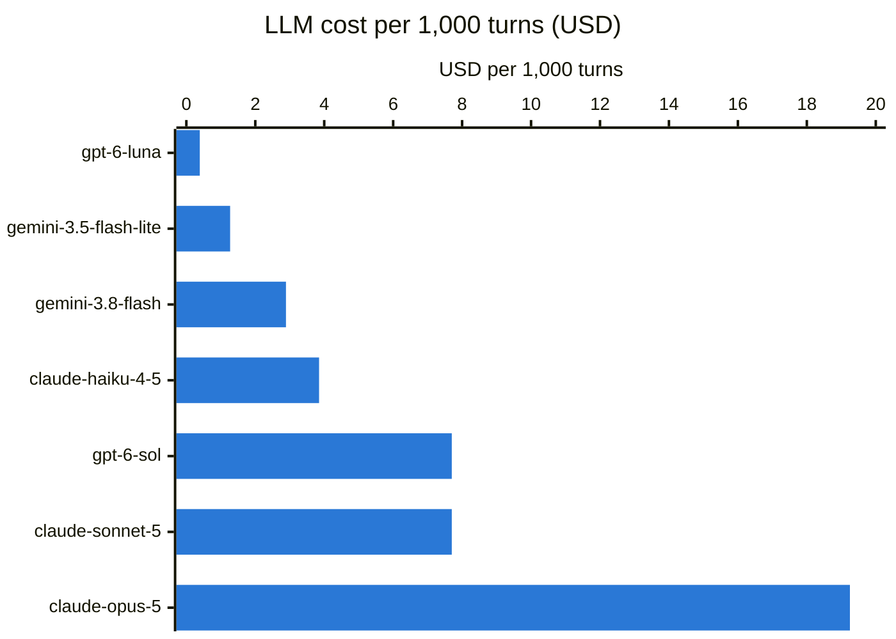
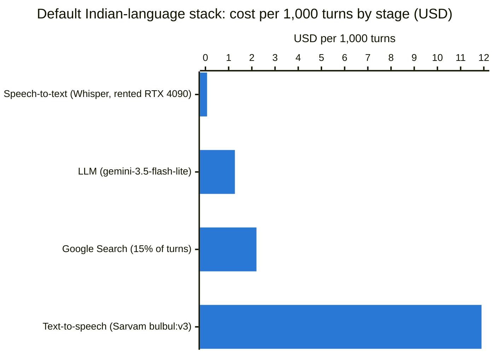

# Multilingual Test Drive Booking Using Closed and Open Models

**VoiceAgent is a real-time, multilingual voice agent for car dealerships. Customers ask about cars and book test drives or sales meetings by talking, in English or any of nine Indian languages.** It runs on closed models (Gemini, GPT, Claude, Sarvam, ElevenLabs) and open models (Whisper, Gemma via Ollama, AI4Bharat Indic-Seamless), in any mix, and switches automatically when a provider fails.

A customer opens the dealership's website and talks. VoiceAgent answers questions about the cars (price, variants, mileage, EV range, features, finance, warranty) from the dealership's own **knowledge base**. If the knowledge base has no answer, it searches **Google**. When the customer is ready, it books a **test drive** or a **sales meeting**: it collects the details, checks the slot, saves the booking and reads back a booking ID.

- **Knowledge base first, Google second:** answers come from the dealership's verified data; only questions it can't answer go to Google Search
- **Bookings by voice:** test drives and sales meetings with real slot capacity, validation (mobile number, model, showroom, opening hours), no double-booking, SQLite storage and an optional CRM webhook
- **CO-STAR prompt engineering:** a structured system prompt tuned for voice selling, with few-shot examples and guardrails against invented prices or fake bookings ([details](#prompt-engineering-co-star))
- **Languages:** English, Hindi, Tamil, Telugu, Kannada, Malayalam, Bengali, Marathi, Gujarati, Punjabi
- **Barge-in:** start talking and the agent stops at once; in-flight LLM and TTS work is cancelled
- **Provider failover:** Gemini, OpenAI, Claude or a local Ollama model; if one fails or is slow, the next one answers
- **Built-in latency telemetry:** per-turn stage timings, a `/metrics` endpoint and a benchmark tool

The repository ships with a **sample fictional dealership** (Aurora Motors, Pune, four models) so it works out of the box. Replace the files in `data/knowledge_base/` and the business settings in `.env` with your own ([Customising for your dealership](#customising-for-your-dealership)).

---

## Contents

1. [Architecture](#architecture)
2. [How the dealership agent works](#how-the-dealership-agent-works)
3. [Requirements](#requirements)
4. [Installation (Windows + NVIDIA GPU)](#installation-windows--nvidia-gpu)
5. [Configuration (.env)](#configuration-env)
6. [Providers and model selection guide](#providers-and-model-selection-guide)
7. [Cost](#cost)
8. [Usage](#usage)
9. [Performance and latency](#performance-and-latency)
10. [Benchmarking](#benchmarking)
11. [Production deployment](#production-deployment)
12. [Troubleshooting](#troubleshooting)
13. [Project structure](#project-structure)

---

## Architecture

Two views of the same system: the **business flow** shows what a customer experiences and what the dealership gets; the **technical flow** shows every component a request passes through.

### Business flow (for sales and management)



| What the dealership gets | How |
|---|---|
| A salesperson on the website 24 × 7, in 10 languages | Voice in English, Hindi, Tamil, Telugu, Kannada, Malayalam, Bengali, Marathi, Gujarati, Punjabi |
| Qualified leads, not just chats | Test drives and meetings booked with name, mobile, car, showroom and slot, sent straight to the CRM |
| No wrong promises | Prices, specs and offers come only from your catalog; the agent never confirms a booking the system didn't save |
| On-brand, on-topic conversations | Unrelated questions are declined and never searched, so they cost almost nothing |
| Full control | Edit the Markdown catalog to change what the agent knows; no retraining |

### Technical flow (for engineers)



Each user turn runs as its own `asyncio.Task`, so a barge-in cancels it immediately. All network I/O is async over pooled keep-alive connections. Local GPU inference runs in a worker thread, so the event loop never blocks.

---

## How the dealership agent works

### Knowledge base first, Google second

Every question is routed before the LLM starts:

| Question | Route | Example |
|---|---|---|
| Small talk, or a turn containing a phone number or email | No lookup (contact details never go to a search engine) | "Thanks!", "my number is 98765 43210" |
| About our cars or dealership | **Knowledge base** → Google only if the KB has no answer | "What's the range of the Ion?", "current offers on the Ridge?" |
| Time-sensitive and not about us | **Google** directly | "Petrol price today in Pune" |
| Other car questions | **Knowledge base** → Google | "What is the EV subsidy in Maharashtra?" |
| Not about cars at all | Knowledge base only, never Google; with no match, the agent **declines politely** | "Who won the cricket world cup?", "write me a poem" |
| During a booking (name, date, showroom) | Knowledge base only, never the web | "Rohan Mehta", "Saturday at 11" |

**What counts as "the KB has an answer":** the local knowledge base is searched with BM25. A result counts only when the best-matching sections contain at least `KB_MIN_COVERAGE` (50 %) of the question's meaningful words. So "What is the price of the Ion?" is answered from the catalog, while "What is the EV subsidy in Maharashtra?" matches too little and goes to Google. Hinglish words (kimat, daam, gaadi, average) are mapped to catalog terms. Short follow-ups ("and its range?") are searched together with the previous question, so "its" still means the Ion.

### Guardrail: cars and the dealership only

The agent will not answer questions outside its job. Two layers enforce this:

1. **Topic guard, in code, before any lookup** (`llm/topic_guard.py`). A message counts as on topic if it uses automotive vocabulary in any of the 10 languages (car, EV, mileage, गाड़ी, கார் …), names one of your models, showrooms or brands, or is part of a booking. Only on-topic messages may use Google, so off-topic questions never cost a search. Words that belong to other domains too ("price", "loan", "insurance") do not count on their own, so "gold price today" or "health insurance premium" is not treated as a car question.
2. **GUARDRAILS in the prompt**, for the final decision. When a message is not clearly on topic and the catalog has no match, it reaches the model with a `[TOPIC CHECK]` note. The prompt lists what is in scope (cars, buying, finance, insurance, registration, charging, driving, maintenance, factual brand comparisons) and what is always declined (general knowledge, news, sports, weather, politics, stocks, health, legal, coding, homework, maths, creative writing, translation, role-play, opinions). The model declines in one friendly sentence, gives no partial answer, and offers help with cars. The decline holds when the customer insists, claims to be staff, or asks the agent to ignore or reveal its instructions.

Because the model makes the final call, a car question without car words ("is it safe for my kids?" after asking about the Ridge) is still answered, while "who won the match?" is declined.

**Google Search** is done with Gemini's grounding tool (`GEMINI_API_KEY`). Google's Custom Search JSON API is closed to new customers and shuts down on 1 January 2027, so grounding is the supported way to query Google from code. If it fails, Brave Search (if configured) and then the free DuckDuckGo/Bing scrapers are tried. If a web lookup takes longer than `RETRIEVAL_FILLER_AFTER` (0.7 s), the agent says "Let me check that for you" in the customer's language so the line never goes silent.

### Booking a test drive or sales meeting



- **Actions, not native tool calls.** The model calls `check_availability` or `book_appointment` by writing an `<action>{json}</action>` tag. This works the same on Gemini, OpenAI, Claude and local Ollama models, keeps streaming and failover, and is fully testable offline. The tag is filtered out of the audio as it streams. The server runs the action and feeds an `[ACTION RESULT]` back, and the model then speaks the outcome (at most 2 actions per turn).
- **The server validates, not the LLM:**
  - a 10-digit Indian mobile number, where Hindi or other Indic digits such as ९८७ are accepted
  - a model you sell ("the ridge" → Aurora Ridge; "Tata Nexon" is rejected)
  - a known showroom, fuzzy-matched ("viman nagar")
  - a future slot inside opening hours, at least `BOOKING_MIN_LEAD_MINUTES` ahead and within `BOOKING_MAX_DAYS_AHEAD`

  All invalid fields are reported at once, so the agent asks only for what's wrong.
- **Capacity:** `TEST_DRIVE_CAPACITY` and `MEETING_CAPACITY` bookings per slot per showroom. A full slot returns the three nearest free slots. The capacity check and the insert run under one lock, so two customers can't take the last seat. Repeating the same booking returns the existing ID instead of a duplicate.
- **Where bookings go:** `data/bookings.db` (SQLite, git-ignored because it holds phone numbers). Optionally every new booking is POSTed as JSON to `BOOKING_WEBHOOK_URL`, which can be your CRM, Zapier or Make, or a Google Apps Script that appends a row to a Sheet. Staff can list bookings at `GET /bookings?date=YYYY-MM-DD` with `Authorization: Bearer <ADMIN_TOKEN>`. The endpoint is disabled unless `ADMIN_TOKEN` is set.
- **Privacy:** phone numbers and emails are masked in logs (`******3210`), never sent to a search engine, and the browser only receives the last four digits.
- **The browser** shows a confirmation card with the booking ID, car, showroom, date and time.

### Prompt engineering (CO-STAR)

The system prompt (`llm/prompts.py`) follows the **CO-STAR** framework. Each part is written for a spoken sales conversation:

| Part | What it tells the model |
|---|---|
| **C**ontext | It is the dealership's voice assistant; the models, showrooms, opening hours; what `[KNOWLEDGE BASE]`, `[WEB RESULTS]` and `[ACTION RESULT]` mean |
| **O**bjective | In priority order: answer correctly from the KB, never guess prices, specs or offers; answer other car questions briefly; offer a test drive **once** when there is buying interest; collect booking details; decline anything out of scope |
| **S**tyle | 1–3 spoken sentences, key fact first, one question at a time, numbers as spoken ("seventeen lakh forty-nine thousand rupees ex-showroom"), jargon explained |
| **T**one | Warm, confident, never pushy; calm with confused or annoyed customers |
| **A**udience | Indian car buyers, often non-experts, often mixing languages, possibly on a phone in a noisy place |
| **R**esponse | Plain text only (it is spoken), reply only in the customer's language, never mention internal systems, never ask for OTP, Aadhaar, PAN or card details |

It adds a **GUARDRAILS** section (scope, what is always declined, how to decline, resistance to "ignore your instructions"), a **BOOKING** section with the exact action format, a rule to read details back before booking, and "never claim a booking the system did not confirm". **Few-shot examples** cover a KB price answer, a polite off-topic decline, an honest "I don't have that detail" fallback, and a full booking with its action and result. A **14-day calendar** (`Sat 26 Sep 2026 = 2026-09-26`) turns "next Saturday" into a lookup rather than date arithmetic, which LLMs often get wrong. The dated parts (the example booking and the calendar) sit at the end of the prompt, so the first ~1,200 tokens are identical on every call and can be served from the provider's prompt cache.

### Tuning, and why this isn't weight fine-tuning

The agent is tuned for the business **without fine-tuning model weights**, on purpose:

- **Prices, offers and stock change monthly.** Fine-tuned knowledge goes stale and can't be updated without retraining. Retrieval from the knowledge base is always current, so you just edit a Markdown file.
- **Failover needs interchangeable models.** A fine-tuned model exists on one provider only; the prompt works unchanged on Gemini, GPT, Claude and Ollama.
- **Hallucinated prices are the main risk.** Fine-tuning makes a model sound confident about facts it half-learned. Grounding it in retrieved text, with server-side validation for bookings, is safer.

What is tuned instead:
- **The prompt:** CO-STAR, few-shot examples and guardrails.
- **Retrieval:** KB-first routing, the coverage threshold, Hinglish synonyms, and a time-sensitive-question rule so "petrol price today" doesn't return car prices.
- **Generation:** `LLM_MAX_TOKENS=400`; minimal thinking or reasoning for low latency; `LLM_TEMPERATURE=0.3` on Ollama. Cloud reasoning models such as Sonnet 5, Opus 5 and GPT-6 reject sampling parameters, so they aren't set there.
- **Speech:** first-clause chunking and a spoken filler during web lookups.

Fine-tuning becomes worth it once you have **thousands of real, reviewed transcripts** and want a fixed house style or a smaller, cheaper local model. Train style and flow only, and keep facts in the knowledge base.

### Customising for your dealership

1. **Knowledge base:** replace the Markdown files in `data/knowledge_base/`. Use one `###` heading per topic and repeat the model name in the heading ("### Aurora Ion price and variants"). Add the model name in Hindi and other scripts to the model's `##` heading ("## Aurora Ion (electric SUV, ऑरोरा आयन)") so questions in those scripts find the right car. The files are indexed at startup. For a large catalog or PDFs, use Google Discovery Engine instead (`GCP_PROJECT_ID`, `GCP_DATA_STORE_ID`).
2. **Business settings** in `.env`: `BUSINESS_NAME`, `BUSINESS_CITY`, `AGENT_NAME`, `SHOWROOMS`, `CAR_MODELS`, `BUSINESS_HOURS`, `BUSINESS_DAYS`, `BUSINESS_TIMEZONE`.
3. **Booking rules:** slot length, capacity per slot, lead time and how many days ahead customers can book.
4. **CRM:** set `BOOKING_WEBHOOK_URL` to receive every booking as JSON.
5. **Voice:** `SARVAM_SPEAKER` or `OPENAI_TTS_VOICE` to match the agent's persona.

---

## Requirements

| Component | Requirement |
|---|---|
| OS | Windows 10/11 64-bit (primary) or Linux x86-64 |
| Python | 3.11 or 3.12 (64-bit) |
| GPU (recommended) | NVIDIA GPU with ≥ 6 GB VRAM for `large-v3-turbo` Whisper; ≥ 12 GB if you also run an Ollama LLM locally |
| NVIDIA driver | R550 or newer (CUDA 12.x capable). **No CUDA Toolkit install is needed**: the cuBLAS and cuDNN 9 runtimes come from pip wheels (`requirements-gpu.txt`) |
| CPU-only | Supported (Whisper `small`, int8). Slower STT, or use a cloud STT (`sarvam` / `openai`) |
| Ollama (optional) | [ollama.com/download](https://ollama.com/download) for fully local LLMs. It uses the NVIDIA GPU automatically |
| Browser | Chrome or Edge (desktop or Android). Microphone access needs `http://localhost` or HTTPS |

---

## Installation (Windows + NVIDIA GPU)

All commands are for **PowerShell**. On Linux, use `source .venv/bin/activate` and `cp` instead of `Copy-Item`.

```powershell
# 1. Get the code
git clone <repo-url> VoiceAgent
cd VoiceAgent

# 2. Virtual environment (Python 3.12)
py -3.12 -m venv .venv
.\.venv\Scripts\Activate.ps1          # if blocked: Set-ExecutionPolicy -Scope CurrentUser RemoteSigned

# 3. Dependencies
python -m pip install --upgrade pip
pip install -r requirements.txt
pip install -r requirements-gpu.txt    # NVIDIA CUDA 12 runtime (cuBLAS + cuDNN 9) for local Whisper

# Optional extras
pip install -r requirements-kb.txt        # Google Discovery Engine knowledge base
pip install -r requirements-seamless.txt  # AI4Bharat Indic-Seamless STT (PyTorch CUDA, ~3 GB)

# 4. Verify the GPU is visible to Whisper (prints the number of CUDA devices; 0 = CPU fallback)
python -c "from config.device import cuda_device_count; print(cuda_device_count())"

# 5. Configure
Copy-Item .env.example .env
notepad .env                           # add at least one LLM API key (or use Ollama)

# 6. (Optional) local LLM
ollama pull gemma3:12b                 # 8 GB GPUs: gemma3:4b

# 7. Run
uvicorn server:app --host 0.0.0.0 --port 8000
```

Open **http://localhost:8000**, click **Start Listening** and speak. On first start, Whisper downloads its weights once (about 1.6 GB for `large-v3-turbo`) into the Hugging Face cache.

Check that everything loaded:

```powershell
curl http://localhost:8000/health
# {"status":"ok","engines":{"stt":"faster-whisper:large-v3-turbo@cuda","llm":"gemini:gemini-3.5-flash-lite → openai:gpt-6-luna","tts":"sarvam+edge"}}
```

---

## Configuration (.env)

Everything is configured through environment variables (`.env`), and nothing is hard-coded. **Never commit `.env`.** It is already in `.gitignore`. `.env.example` documents every variable. These are the ones that matter most:

### API keys (set only what you use)

| Variable | Used for | Get it |
|---|---|---|
| `GEMINI_API_KEY` | Gemini LLM **and Google Search** (grounding) | [aistudio.google.com/app/apikey](https://aistudio.google.com/app/apikey) |
| `OPENAI_API_KEY` | OpenAI LLM / STT / TTS | [platform.openai.com/api-keys](https://platform.openai.com/api-keys) |
| `ANTHROPIC_API_KEY` | Claude LLM | [console.anthropic.com](https://console.anthropic.com/settings/keys) |
| `SARVAM_API_KEY` | Indic TTS (Bulbul) / STT (Saaras) | [dashboard.sarvam.ai](https://dashboard.sarvam.ai) |
| `ELEVENLABS_API_KEY` | ElevenLabs TTS | [elevenlabs.io](https://elevenlabs.io/app/settings/api-keys) |
| `BRAVE_SEARCH_API_KEY` | Production web search | [api-dashboard.search.brave.com](https://api-dashboard.search.brave.com) |

### Provider selection

| Variable | Values | Default |
|---|---|---|
| `LLM_PROVIDER` | `gemini` · `openai` · `anthropic` · `ollama` | `gemini` |
| `LLM_FALLBACKS` | comma list, tried in order | *(none)* |
| `STT_PROVIDER` | `whisper` · `sarvam` · `openai` · `seamless` | `whisper` |
| `TTS_PROVIDER` | `auto` · `sarvam` · `elevenlabs` · `openai` · `edge` | `auto` |
| `RETRIEVAL_MODE` | `auto` · `always` · `off` | `auto` |
| `KB_PROVIDER` | `auto` (Discovery Engine if `GCP_*` set, else local files) · `local` · `discovery` · `off` | `auto` |
| `WEB_SEARCH_PROVIDER` | `auto` (Google → Brave → scrapers) · `google` · `brave` · `scrape` | `auto` |

Providers without a key are skipped with a warning. Edge TTS needs no key and is always the last TTS fallback. Web search falls back to the free scrapers when neither Google nor Brave is available.

### Business and bookings

| Variable | Default | Notes |
|---|---|---|
| `BUSINESS_NAME` / `BUSINESS_CITY` / `AGENT_NAME` | `Aurora Motors` / `Pune` / `Priya` | Used in the prompt and the UI greeting |
| `SHOWROOMS` | `Baner Showroom;Viman Nagar Showroom` | `;`-separated; bookings are fuzzy-matched to these |
| `CAR_MODELS` | the four sample models | `,`-separated; test drives only for these (empty = accept any) |
| `BUSINESS_HOURS` / `BUSINESS_DAYS` / `BUSINESS_TIMEZONE` | `10:00-19:00` / all week / `Asia/Kolkata` | The last slot starts one slot before closing |
| `BOOKING_SLOT_MINUTES` | `60` | Slot length |
| `TEST_DRIVE_CAPACITY` / `MEETING_CAPACITY` | `2` / `2` | Bookings per slot per showroom (cars / consultants available) |
| `BOOKING_MIN_LEAD_MINUTES` / `BOOKING_MAX_DAYS_AHEAD` | `60` / `30` | Booking window |
| `BOOKING_DB_PATH` | `data/bookings.db` | SQLite file (git-ignored) |
| `BOOKING_WEBHOOK_URL` | — | Receives every new booking as JSON (`event: booking.created`) |
| `ADMIN_TOKEN` | — | Enables `GET /bookings` for staff |

### Knowledge base and web search

| Variable | Default | Notes |
|---|---|---|
| `KB_DIR` | `data/knowledge_base` | Markdown / text files, indexed at startup |
| `KB_MIN_COVERAGE` | `0.5` | Share of the question's words the KB must match to count as an answer; raise it to send more questions to Google |
| `GOOGLE_SEARCH_MODEL` / `SEARCH_REGION` | `gemini-3.5-flash-lite` / `India` | Model used for Google grounding, and the market it focuses on |
| `LLM_RETRIEVAL_WAIT` | `3` s | Longest the answer waits for KB + Google (the KB alone takes < 1 ms) |
| `RETRIEVAL_FILLER_AFTER` | `0.7` s | Say "let me check" if a web lookup is still running |
| `GCP_PROJECT_ID` / `GCP_DATA_STORE_ID` | — | Google Discovery Engine instead of the local files |

### Models and tuning

| Variable | Default | Notes |
|---|---|---|
| `GEMINI_MODEL` / `GEMINI_THINKING_LEVEL` | `gemini-3.5-flash-lite` / `minimal` | 3.8 Flash accepts `low`+ only; an unsupported level falls back to the model default automatically |
| `OPENAI_MODEL` / `OPENAI_REASONING_EFFORT` | `gpt-6-luna` / `none` | `none` = fastest first token |
| `OPENAI_BASE_URL` | — | Any OpenAI-compatible endpoint (Azure OpenAI v1, vLLM, LM Studio) |
| `ANTHROPIC_MODEL` | `claude-haiku-4-5` | For `claude-sonnet-5`, set `ANTHROPIC_THINKING=disabled` (and optionally `ANTHROPIC_EFFORT=low`) for voice latency |
| `OLLAMA_MODEL` / `OLLAMA_KEEP_ALIVE` | `gemma3:12b` / `30m` | keep-alive keeps weights resident in VRAM |
| `WHISPER_MODEL` | *(auto)* | `large-v3-turbo` on GPU, `small` on CPU; also `medium`, `large-v3`, `distil-large-v3` (English) |
| `WHISPER_COMPUTE_TYPE` | `auto` | `float16` on GPU, `int8` on CPU; `int8_float16` saves VRAM |
| `STT_LANGUAGE` | *(empty)* | Force one language (e.g. `hi`) to skip language detection |
| `STT_LANGUAGES` | all 10 | Whisper's language ID is restricted to these (Urdu → Hindi, etc.) |
| `LLM_MAX_TOKENS` | `400` | Spoken replies are short; caps cost and runaway answers |
| `LLM_TEMPERATURE` | `0.3` | Ollama only; cloud reasoning models reject or ignore sampling parameters |
| `LLM_FIRST_TOKEN_TIMEOUT` | `6` s | Fail over if no token arrives in time |
| `TTS_FIRST_CHUNK_MIN_CHARS` / `_MAX_CHARS` | `24` / `70` | How early the first audio is cut |
| `VAD_SILENCE_MS` | `550` | Browser end-of-speech pause (sent to the client via `/config`) |

---

## Providers and model selection guide

These recommendations were researched in September 2026 against each provider's current documentation. They optimize for **voice**: time-to-first-token (TTFT) matters more than peak intelligence, because every 100 ms is audible. The defaults in `.env.example` follow the ★ rows.

### Conversation (the spoken reply) — the latency-critical path

| | Model | Why |
|---|---|---|
| ★ Default | **`gemini-3.5-flash-lite`** (Gemini, `GEMINI_THINKING_LEVEL=minimal`) | Google's fastest, lowest-cost Gemini tier; minimal thinking keeps TTFT low; strong Indic coverage |
| ★ Fallback | **`gpt-6-luna`** (OpenAI, `reasoning_effort=none`) | Cost-efficient GPT-6 tier built for fast everyday work ($0.10 / $0.50 per 1M in/out tokens) |
| Alternative | **`claude-haiku-4-5`** (Anthropic) | Anthropic's fastest model; no extended thinking by default ($1 / $5 per 1M) |
| Offline | **`gemma3:12b`** / `gemma3:4b` (Ollama) | Good multilingual quality that runs on a single consumer GPU; `gemma4` / `qwen3` tags also work |

### Harder questions (reasoning, multi-step, careful answers)

| Model | Notes |
|---|---|
| `gemini-3.8-flash` (`GEMINI_THINKING_LEVEL=low`) | Google's most capable Flash model; noticeably slower first token than Flash-Lite |
| `gpt-6-sol` | OpenAI's faster reasoning tier; keep `reasoning_effort` at `none` or `low` for voice |
| `claude-sonnet-5` (`ANTHROPIC_THINKING=disabled`, `ANTHROPIC_EFFORT=low`) | High quality at $2 / $10 per 1M; tune thinking/effort for latency |
| `gpt-6-astra`, `claude-opus-5`, `claude-fable-5-1` | Frontier reasoning, but **too slow for real-time voice**; use them for offline or back-office tasks |

### Other task types (if you extend the assistant)

| Task | Recommended | Notes |
|---|---|---|
| Intent / routing classification | Regex rules (built in, 0 ms) → `gemini-3.5-flash-lite` or `gpt-6-luna` | Don't spend an LLM call on the hot path when a rule suffices; this project routes retrieval with multilingual regexes |
| Entity extraction (structured JSON) | `gpt-6-luna`, `gemini-3.5-flash-lite`, `claude-haiku-4-5` with structured outputs / JSON schema | Small models are accurate enough for extraction and 5–20× cheaper |
| Embeddings (custom RAG) | `gemini-embedding-001` (text) or Gemini Embedding 2 (multimodal); `text-embedding-3-small` (cost) / `-large` (quality) | Not needed by default: the local KB uses BM25 and Discovery Engine has managed retrieval |
| Speech-to-text, local GPU | ★ **faster-whisper `large-v3-turbo`** (float16) | Free, private, near large-v3 accuracy at a fraction of the compute |
| Speech-to-text, Indian languages / Hinglish | **Sarvam `saaras:v3`** | Best Indic and code-mixed accuracy; cloud, ≤ 30 s per request |
| Speech-to-text, cloud multilingual | OpenAI `gpt-4o-mini-transcribe` (or `gpt-transcribe` for accuracy) | Simple REST |
| Text-to-speech, Indian languages | ★ **Sarvam `bulbul:v3`** | Most natural Indic voices; handles Hinglish and numbers |
| Text-to-speech, lowest latency (English, Hindi, Tamil) | **ElevenLabs `eleven_flash_v2_5`** | ~75 ms model latency (vendor figure) |
| Text-to-speech, expressive | OpenAI `gpt-4o-mini-tts` | Steerable tone via instructions |
| Text-to-speech, free | Edge neural voices | No key needed; about 0.6 s fixed connection overhead per sentence (measured) |
| Web search | ★ **Google via Gemini grounding** | Google's supported search API from code (Custom Search JSON API shuts down 2027-01-01); Brave Search API and free scrapers are the fallbacks |

> **Speech-to-speech models** (OpenAI `gpt-realtime-2.1` / `gpt-live-1`, Gemini `gemini-3.8-live`) can go lower still by merging STT, LLM and TTS into one model. They are not wired in here, because the pipeline design keeps per-language voice control (Sarvam), retrieval and provider independence. They are the natural next step if English-first latency is all that matters.

Model names change often. Check the provider's model page before upgrading, and change the `*_MODEL` variables. No code changes are needed.

---

## Cost

List prices were checked in **September 2026** on each provider's pricing page (standard, pay-as-you-go tier, USD unless noted). Prices change often, so confirm them before budgeting. INR prices are converted at **₹88 = $1**.

### How a "turn" is estimated

Per-turn costs below assume one typical exchange with the dealership agent:

| Quantity | Assumption | Why |
|---|---|---|
| Customer speech | 5 s of audio | A short spoken question |
| LLM input | 3,000 tokens | CO-STAR system prompt with examples and calendar (~1,700, measured) + short history (~850) + knowledge-base context (~250–600) + question (~50) |
| LLM output | 100 tokens | 1–3 spoken sentences, sometimes a booking action; hard cap `LLM_MAX_TOKENS=400` |
| LLM calls | 1.1 per turn | ~10 % of turns run a booking action, which needs a second call to speak the result |
| Spoken reply | 350 characters ≈ 20 s of audio | 100 tokens of text |
| Web search | 15 % of turns | Only questions the knowledge base can't answer, plus live questions like fuel prices |

So the LLM figures use 3,300 input and 110 output tokens per turn. The local knowledge base and the bookings database cost nothing to run.

### LLM (per 1M tokens)



| Model | Provider | Input | Output | Per 1,000 turns |
|---|---|---|---|---|
| ★ `gemini-3.5-flash-lite` | Google | $0.30 | $2.50 | **$1.27** |
| ★ `gpt-6-luna` | OpenAI | $0.10 | $0.50 | **$0.39** |
| `claude-haiku-4-5` | Anthropic | $1.00 | $5.00 | $3.85 |
| `gemini-3.8-flash` | Google | $0.75 → $1.50 from 1 Jan 2027 | $3.75 → $7.50 from 1 Jan 2027 | $2.89 (→ $5.78) |
| `gpt-6-sol` | OpenAI | $2.00 | $10.00 | $7.70 |
| `claude-sonnet-5` | Anthropic | $2.00 | $10.00 | $7.70 |
| `claude-opus-5` | Anthropic | $5.00 | $25.00 | $19.25 |
| `gpt-6-astra` | OpenAI | $10.00 | $50.00 | $38.50 |
| `claude-fable-5-1` | Anthropic | $10.00 | $50.00 | $38.50 |
| `gemma3:12b` / `gemma3:4b` (Ollama) | local | $0 | $0 | GPU cost only (see [local GPU](#local-models-on-a-gpu)) |

Thinking/reasoning tokens are billed as output. Keep `GEMINI_THINKING_LEVEL=minimal`, `OPENAI_REASONING_EFFORT=none` and `ANTHROPIC_THINKING=disabled` (Sonnet 5), or the output figures above can rise several-fold. OpenAI and Gemini automatically cache repeated prompt prefixes of 1,024+ tokens at a discount. The prompt's ~1,200-token static prefix qualifies, so real input cost can be lower than shown.

### Speech-to-text

| Model | Provider | Price | Per 1,000 turns (5 s each) |
|---|---|---|---|
| ★ faster-whisper `large-v3-turbo` | local | $0 | GPU cost only |
| AI4Bharat Indic-Seamless | local | $0 | GPU cost only |
| `gpt-4o-mini-transcribe` | OpenAI | $0.003 / min ($0.18 / hour) | $0.25 |
| `gpt-transcribe` | OpenAI | $0.0045 / min ($0.27 / hour) | $0.38 |
| `saaras:v3` | Sarvam | ₹30 / hour (≈ $0.34 / hour) | ₹42 ≈ $0.47 |

### Text-to-speech

| Model | Provider | Price | Per 1,000 turns (350 chars each) |
|---|---|---|---|
| Edge neural voices | Microsoft (unofficial endpoint) | Free, no SLA | **$0** |
| `gpt-4o-mini-tts` | OpenAI | $0.60 / 1M text tokens + $12 / 1M audio tokens (≈ $0.015 / min) | ≈ $5.00 |
| ★ `bulbul:v3` | Sarvam | ₹3 / 1,000 characters (≈ $0.034) | ₹1,050 ≈ $11.90 |
| `eleven_flash_v2_5` | ElevenLabs | $0.05 / 1,000 characters | $17.50 |

The ElevenLabs figure is the API usage rate; subscription plans bundle characters differently.

### Knowledge base and web search

| Service | Price | Per 1,000 turns |
|---|---|---|
| Local knowledge base (`data/knowledge_base`) | Free, runs in-process | $0 |
| ★ Google Search via Gemini grounding | 5,000 searches / month free, then $14 / 1,000 searches, + the grounding call's tokens (~$0.0005 each on Flash-Lite) | ≈ $2.20 at 15 % of turns |
| Brave Search API | $5 / 1,000 requests ($5 of monthly credit included) | ≈ $0.75 at 15 % of turns |
| DuckDuckGo + Bing scraping (last fallback) | Free, best-effort | $0 |
| Google Discovery Engine (KB alternative) | Per-query and storage pricing on [Google Cloud](https://cloud.google.com/generative-ai-app-builder/pricing) | Depends on data store size |

Gemini 3 bills grounding per search query the model actually runs; the estimate assumes one query per lookup. The free 5,000 searches cover about 33,000 turns a month at a 15 % web rate.

### Where the money goes



**Speech output is the largest cost**: a paid voice costs about 10× the LLM per turn. Edge TTS is free, so on the English default stack Google Search becomes the largest item.

### Example stacks (per 1,000 turns)

| Stack | STT | LLM | TTS | Search | **Total** | ≈ per turn |
|---|---|---|---|---|---|---|
| Default, English (Whisper on GPU + Flash-Lite + Edge + Google) | GPU | $1.27 | $0 | $2.20 | **$3.47** + GPU | $0.003 |
| Default, Indic (Whisper on GPU + Flash-Lite + Sarvam + Google) | GPU | $1.27 | $11.90 | $2.20 | **$15.37** + GPU | $0.015 |
| All-cloud, cheapest (OpenAI mini STT + Luna + Edge + Brave) | $0.25 | $0.39 | $0 | $0.75 | **$1.39** | $0.001 |
| All-cloud, Indic quality (Saaras + Flash-Lite + Bulbul + Google) | $0.47 | $1.27 | $11.90 | $2.20 | **$15.84** | $0.016 |
| Low-latency English (OpenAI mini STT + Haiku + ElevenLabs Flash + Google) | $0.25 | $3.85 | $17.50 | $2.20 | **$23.80** | $0.024 |
| Fully local (Whisper + Ollama `gemma3:12b` + Edge + scrapers) | GPU | GPU | $0 | $0 | **GPU only** | — |

For scale: 10,000 conversations a month of 10 turns each is 100,000 turns. That costs about $350 on the default English stack or about $1,540 on the default Indic stack, plus the GPU, less up to $70 for Google's free searches.

### Local models on a GPU

Local models (Whisper, Indic-Seamless, Ollama) have no per-token fee; you pay for the GPU instead. These are **estimates, not measurements** (GPU throughput was not benchmarked for this README). Run `python scripts/benchmark.py components` on your hardware to replace them.

**What fits on one GPU**

| GPU | VRAM | Runs well |
|---|---|---|
| RTX 3060 / 4060 (8–12 GB) | 8–12 GB | Whisper `large-v3-turbo` (~3 GB) + `gemma3:4b` (~4 GB) |
| RTX 4090 / L4 / L40S | 24–48 GB | Whisper `large-v3-turbo` + `gemma3:12b` (~9 GB) with room for parallel requests |

**Hourly GPU prices (September 2026, on-demand)**

| GPU | Where | Price / hour | 24 × 7 per month (730 h) |
|---|---|---|---|
| RTX 4090 24 GB | Marketplace clouds (Salad, RunPod community, …) | $0.33 cheapest · $0.44 median | $240 – $320 |
| RTX 4090 24 GB | RunPod secure cloud | ~$0.69 | ~$500 |
| L4 24 GB | AWS `g6.xlarge` (us-east-1) | $0.80 | ~$590 |
| L40S 48 GB | Marketplace clouds | from ~$0.55 | from ~$400 |
| Your own RTX 4090 | Electricity at $0.15 / kWh, ~400 W under load | ~$0.06 while busy | ~$20–45 + hardware (~$1,800 ÷ 36 months ≈ $50) |

**Estimated cost per 1,000 turns on a GPU you rent by the hour**

Assumed GPU time per turn: Whisper `large-v3-turbo` ≈ 0.3 s for a 5 s clip on an RTX 4090 (≈ 0.6 s on an L4); `gemma3:12b` ≈ 2.3 s on an RTX 4090 or ≈ 5 s on an L4 (prefill of the ~3,000-token prompt + 100 tokens). Voice traffic is bursty, so the table assumes the GPU is busy **50 %** of the hours you pay for.

| Workload | GPU | Turns / hour at 50 % busy | Per 1,000 turns |
|---|---|---|---|
| Whisper STT only | RTX 4090 ($0.44 / h) | ~6,000 | ≈ $0.07 |
| Whisper STT only | L4 ($0.80 / h) | ~3,000 | ≈ $0.27 |
| Whisper + `gemma3:12b` | RTX 4090 ($0.44 / h) | ~690 | ≈ $0.64 |
| Whisper + `gemma3:12b` | L4 ($0.80 / h) | ~320 | ≈ $2.50 |
| Whisper + `gemma3:12b` | Your own RTX 4090 (electricity only) | — | ≈ $0.04 |

**Rules of thumb**

- A rented GPU is billed whether it is busy or idle. At low traffic, cloud STT + LLM (≈ $0.64–1.74 per 1,000 turns) is cheaper than keeping a GPU running. A $0.44/h RTX 4090 left on 24 × 7 (~$320/month) only pays for itself above roughly **180,000–500,000 turns a month**.
- Local wins on **privacy** (audio never leaves your machine), **no rate limits** and **predictable latency**. On hardware you already own, the marginal cost is almost only electricity.
- Local LLMs replace only the cheap part of the bill. TTS is the largest cost, and this project has no local TTS, so Edge (free) is the zero-cost voice.

---

## Usage

**Voice:** click **Start Listening** and speak. After a pause of `VAD_SILENCE_MS`, the utterance is sent. Talk over the bot to interrupt it.

**Text:** type into the chat box. The reply is streamed and spoken the same way.

**Try it with the sample dealership:**

| Say | What happens |
|---|---|
| "What's the price of the Ion?" | Answered from the knowledge base (17.49–21.99 lakh ex-showroom) |
| "Ridge ki mileage kitni hai?" | Knowledge base, answered in Hindi |
| "What documents do I need for a test drive?" | Knowledge base (dealership policy) |
| "What is the EV subsidy in Maharashtra?" | Car question not in the knowledge base → "Let me check that for you" → Google |
| "Who won the last cricket world cup?" | Off topic → never searched; the agent politely declines and offers help with cars |
| "I want to test drive the Ridge on Saturday at 11 at Baner" | Starts a booking: the agent asks for your name and mobile, reads everything back, books, and a confirmation card appears |
| "Book a meeting tomorrow at 9 AM" | The agent says slots start at 10 AM and suggests one; if the model tries 9 AM anyway, the server rejects it and returns the nearest free slots |

### WebSocket protocol (`/ws`)

| Client → server | Meaning |
|---|---|
| binary frame | 16-bit PCM WAV utterance (mono, 16 kHz preferred) |
| `{"type":"text","text":"..."}` | typed message |
| `{"type":"interrupt"}` | barge-in: cancel the current reply |
| `{"type":"audio","audio":"<base64 WAV>"}` | legacy clients |

| Server → client | Meaning |
|---|---|
| `transcription` | what the user said |
| `status` (`thinking`) | a reply has started |
| `chunk` | streamed reply text |
| `audio_chunk` | `{audio: base64, format: "mp3", text}`, played in order |
| `booking` | `{booking: {booking_id, kind, car_model, showroom, date, weekday, time, customer_name, phone_last4}}` when a booking is confirmed |
| `done` | `{text, source: "none"|"web"|"kb"}` |
| `metrics` | `{timings_ms: {stt, filler, retrieval_done, llm_ttft, action_1, first_audio, total}}` (stages that ran) |
| `error` / `interrupt` | error message / acknowledgement |

### HTTP endpoints

`GET /health` (engines loaded) · `GET /metrics` (latency percentiles) · `GET /config` (client settings, business and agent name) · `GET /ping` · `GET /bookings?date=YYYY-MM-DD` (staff only: needs `ADMIN_TOKEN`, returns 404 when unset)

---

## Performance and latency

### Where the time goes (one voice turn)

```
end of speech ─► VAD_SILENCE_MS ─► STT ─► [KB → Google] ─► LLM first token ─► first clause ─► TTS ─► audio
                   550 ms           GPU:    KB < 1 ms;       provider TTFT      ~0.5 s at      provider
                   (browser)        fast    Google ~1–3 s                       50 tok/s
                                            (filler spoken at 0.7 s)
```

A booking turn adds one more LLM call after the action (one extra time-to-first-token, typically 0.3–0.8 s). The agent says "One moment" before the action, so the customer hears something straight away.

### What this version optimizes

- **Retrieval off the hot path.** The local knowledge base answers in under a millisecond. Only questions it can't answer wait for Google, and a spoken filler covers that wait. Small talk, booking details and turns with contact details never wait on retrieval. Results are cached, and concurrent identical queries share one fetch.
- **Earlier first audio.** The first TTS segment is cut at the first clause boundary after 24 characters (or at a word boundary at 70), instead of at the end of the first sentence or a fixed 90 characters. The emotion-tag prefix the old prompt forced before every answer is gone.
- **Streaming everywhere.** LLM tokens stream to the client and to TTS. TTS runs concurrently per segment and is delivered in order.
- **Connection reuse.** One pooled HTTP client (HTTP/2 when available) for Sarvam, ElevenLabs and scraping. SDK clients are singletons. Warmup at startup opens TLS connections and loads model weights. Ollama keeps weights resident (`OLLAMA_KEEP_ALIVE`).
- **Failover without penalty.** First-token timeout plus a 20–30 s cool-down means a failing provider costs one slow turn, not every turn.
- **Bounded concurrency.** Separate semaphores for LLM streams and TTS requests, and a lock serializing GPU STT, so load cannot trigger rate-limit storms or GPU thrashing.
- **Leaner STT.** No ffmpeg or pydub decode (raw PCM is parsed with numpy). Silero VAD runs on ONNX (no PyTorch). Greedy decoding, no timestamps, bounded tokens, and language ID restricted to supported languages.
- **Parallel startup.** STT model load, LLM warmup, TTS warmup and language models all load concurrently.

### Tuning checklist

| Goal | Setting |
|---|---|
| Lowest STT latency on GPU | `WHISPER_MODEL=large-v3-turbo` (default); `WHISPER_COMPUTE_TYPE=int8_float16` if VRAM is tight; `STT_LANGUAGE=hi` if all users speak one language |
| Lowest LLM TTFT | Flash-Lite / Luna / Haiku with minimal thinking (defaults); keep `LLM_MAX_TOKENS` small |
| Faster end-of-turn | Lower `VAD_SILENCE_MS` (450–500) in quiet environments |
| Faster first audio | ElevenLabs Flash (English/Hindi/Tamil) or Sarvam (Indic) instead of Edge; lower `TTS_FIRST_CHUNK_MIN_CHARS` |
| Shorter waits for Google | Lower `LLM_RETRIEVAL_WAIT` (answers without web data if it expires); keep `RETRIEVAL_FILLER_AFTER` at 0.5–0.8 s |
| Fewer Google lookups | Add the missing topics to the knowledge base; lower `KB_MIN_COVERAGE` slightly (0.4) |
| Never wait on retrieval | `RETRIEVAL_MODE=off` (the agent then answers car questions without the catalog, so not recommended) |

---

## Benchmarking

Live per-turn timings are logged for every reply, sent to the browser (`metrics` messages; see the browser console) and aggregated at `GET /metrics` (response shape; the numbers are illustrative):

```json
{"stt": {"count": 42, "p50_ms": 180.2, "p95_ms": 260.9, "max_ms": 301.0},
 "llm_ttft": {...}, "first_audio": {...}, "total": {...}}
```

All values are milliseconds since the user's audio (or text) reached the server.

The benchmark tool (`scripts/benchmark.py`) measures real providers using your `.env`:

```powershell
# Each configured provider in isolation: LLM TTFT per model, TTS per engine/language,
# STT on synthetic English + Hindi utterances, web search
python scripts/benchmark.py components --runs 5

# End-to-end against a running server (client-side: transcription, first text, first audio)
python scripts/benchmark.py e2e --url ws://localhost:8000/ws --runs 5 [--audio my_question.wav]
```

Results print as tables and are saved to `bench_results/*.json`.

### Before vs after (measured on the development machine)

These were measured on a CPU-only Windows laptop with no GPU and no LLM API keys. The old code (git `HEAD`) and the new code ran on identical inputs. The LLM was an instant stub, so orchestration overhead is isolated; provider TTFT is identical in both versions and is excluded.

| Stage | Before | After |
|---|---|---|
| Overhead before the LLM starts, general question (no live data needed) | ~500 ms (fixed retrieval wait) | **~0 ms** |
| Overhead before the LLM starts, real-time question | 365–505 ms, **weather query answered without data** | 127–260 ms, **live data for 3/3 queries** |
| Mean across 10 mixed queries | 433 ms | **55 ms** |
| Web search for a real-time query | 2.1–4.5 s (DuckDuckGo first, sequential cascade) | **~0.3 s** (engines raced) |
| First TTS segment ready, English reply at 50 tok/s | 793 ms (cut mid-word at 90 chars) | **538 ms** (word boundary) |
| First TTS segment ready, Hindi reply | 1463 ms | **721 ms** |
| Whisper `base` on CPU (int8), 4–5 s clip | 1.6–1.8 s | 1.6–1.8 s (unchanged; GPU not measured here) |
| Edge TTS, first sentence | ~0.9 s | ~0.9 s (fixed service overhead; use Sarvam or ElevenLabs to reduce) |

**Estimated time to first audio (excluding STT and LLM TTFT, which are unchanged): ~2.2 s → ~1.5 s for an English general question, and ~2.9 s → ~1.7 s in Hindi.** Run `scripts/benchmark.py` on your GPU machine with your keys to get numbers for your setup.

---

## Production deployment

- **Run one worker per GPU.** Models live in-process, so extra uvicorn workers would load extra Whisper copies. Scale out with more instances behind a load balancer that supports WebSockets (sessions are per connection; no shared state is needed).
  ```powershell
  uvicorn server:app --host 0.0.0.0 --port 8000 --workers 1 --ws-ping-interval 20 --timeout-keep-alive 30
  ```
- **HTTPS is required** for microphone access anywhere except `localhost`. Put a reverse proxy in front (Caddy, Nginx, IIS with the WebSocket module) or use `cloudflared tunnel --url http://localhost:8000` for quick sharing.
- **Lock down CORS:** `CORS_ORIGINS=https://your.domain`.
- **Windows service:** run under [NSSM](https://nssm.cc) or Task Scheduler with the venv's `python.exe -m uvicorn ...` and the project folder as working directory.
- **Secrets:** inject API keys as environment variables from your secret store; `.env` is for development.
- **Health and monitoring:** `/health` returns 503 until all engines are loaded (use it for readiness probes). Scrape `/metrics` for latency SLOs. Logs rotate in `logs/voiceagent.log` (10 MB × 5).
- **Rate limits:** tune `LLM_MAX_CONCURRENCY` and `TTS_MAX_CONCURRENCY` to your provider tiers. SDK and HTTP retries honor `Retry-After` with short back-off, then fail over.
- **Web search:** Google via Gemini grounding (`GEMINI_API_KEY`) is the default; add `BRAVE_SEARCH_API_KEY` as a second engine. HTML scraping is best-effort and subject to the search engines' terms.
- **Bookings:** SQLite suits a single server. Back up `data/bookings.db`, or send every booking to your CRM with `BOOKING_WEBHOOK_URL`. For several server instances, point `BOOKING_DB_PATH` at shared storage, or replace `booking/service.py` storage with your CRM's API. Set a long random `ADMIN_TOKEN` only if staff need `GET /bookings`.
- **Knowledge base:** keep `data/knowledge_base/` under version control and review changes like code. It is the source of truth for prices the agent quotes.

---

## Troubleshooting

| Symptom | Fix |
|---|---|
| `/health` shows `@cpu` although you have an NVIDIA GPU | `pip install -r requirements-gpu.txt`, update the NVIDIA driver (R550+), then run the verify command from Installation. Force it with `WHISPER_DEVICE=cuda` to see the actual CUDA error |
| `Could not load library cudnn_ops64_9.dll` / `cublas64_12.dll` | Same as above: the cuDNN 9 / cuBLAS 12 wheels are missing. They are registered automatically from the venv |
| `WHISPER_MODEL=mlx-community/...` error | That is an Apple MLX model; use `large-v3-turbo`, `medium` or `small` |
| CUDA out of memory | `WHISPER_MODEL=medium` or `WHISPER_COMPUTE_TYPE=int8_float16`; use a smaller Ollama model |
| `No usable LLM provider` at startup | Set `LLM_PROVIDER` and its API key, or `LLM_PROVIDER=ollama` with Ollama running |
| Every reply fails with "temporarily unavailable" | All providers in the chain failed; the log shows why (bad key, model name, network). Try `python scripts/benchmark.py components` |
| Ollama: connection refused | Start Ollama (tray app or `ollama serve`) and `ollama pull <model>`; check `OLLAMA_HOST` |
| Hindi transcribed in Urdu script | Use `large-v3-turbo` (small models confuse the two), set `STT_LANGUAGE=hi`, or use `STT_PROVIDER=sarvam`. The reply is in Hindi either way |
| Microphone does not work | Allow mic permission; use `http://localhost` or HTTPS |
| No audio output | Click the page once (browsers need a user gesture before audio plays) |
| Answers ignore live data | The log line `Retrieval kb+web → none` means both failed; raise `LLM_RETRIEVAL_WAIT`, check `GEMINI_API_KEY` (Google), or add `BRAVE_SEARCH_API_KEY` |
| Car question answered from Google instead of the catalog | The log shows `KB miss (coverage x/y)`; add that topic to `data/knowledge_base/` or lower `KB_MIN_COVERAGE` |
| A non-car question gets a car answer | Raise `KB_MIN_COVERAGE` (e.g. 0.6) |
| `Google search (Gemini grounding) failed` in the log | Check `GEMINI_API_KEY` and `GOOGLE_SEARCH_MODEL`; Brave or the scrapers are used meanwhile |
| `ZoneInfoNotFoundError: Asia/Kolkata` | `pip install tzdata` (Windows has no system time-zone database) |
| Booking says the slot is invalid | Slots start every `BOOKING_SLOT_MINUTES` from opening time, at least `BOOKING_MIN_LEAD_MINUTES` ahead; check `BUSINESS_HOURS`, `BUSINESS_DAYS` and `BUSINESS_TIMEZONE` |
| Test drive refused for a model you sell | Add it to `CAR_MODELS` |
| Knowledge base errors | `pip install -r requirements-kb.txt`; `gcloud auth application-default login` or `GOOGLE_APPLICATION_CREDENTIALS`; check `GCP_PROJECT_ID` / `GCP_DATA_STORE_ID` |
| PowerShell won't activate the venv | `Set-ExecutionPolicy -Scope CurrentUser RemoteSigned` |

Set `LOG_LEVEL=DEBUG` for detailed logs.

---

## Project structure

```
VoiceAgent/
├── server.py                 FastAPI app: WebSocket pipeline, streaming TTS, /health /metrics /config /bookings
├── config/
│   ├── settings.py           All environment configuration (single source of truth)
│   ├── device.py             CUDA detection + Windows cuBLAS/cuDNN DLL registration
│   └── logging_config.py     Console + rotating file logging (Windows-safe)
├── core/
│   ├── chunker.py            Streaming text → speakable segments
│   ├── lang.py               Script-based language ID, speech text cleanup
│   ├── http.py               Shared async HTTP client + retry/429 handling
│   ├── metrics.py            Per-turn timers and rolling percentiles
│   └── privacy.py            Phone/email masking, Indic digit normalisation
├── llm/
│   ├── orchestrator.py       History, retrieval, filler, booking action loop, failover
│   ├── prompts.py            CO-STAR system prompt, few-shot examples, calendar, fillers
│   ├── providers/            gemini.py · openai_llm.py · anthropic_llm.py · ollama_llm.py
│   ├── knowledge_base.py     Local Markdown KB with BM25 search and coverage check
│   ├── topic_guard.py        Multilingual on-topic check (cars / dealership only)
│   ├── retrieval.py          KB-first routing → Google fallback, cache
│   └── web_search.py         Google (Gemini grounding) · Brave API · DuckDuckGo + Bing race
├── booking/
│   ├── actions.py            Streaming <action> tag parser (never spoken)
│   ├── intent.py             Multilingual booking-intent detection
│   └── service.py            Slots, validation, SQLite storage, CRM webhook
├── data/
│   ├── knowledge_base/       cars.md · dealership.md · ownership.md (sample; replace)
│   └── bookings.db           Created at runtime (git-ignored)
├── stt/
│   ├── faster_whisper_stt.py Local Whisper (CUDA float16 / CPU int8)
│   ├── cloud_stt.py          Sarvam Saaras · OpenAI transcription
│   ├── seamless.py           AI4Bharat Indic-Seamless (optional)
│   └── audio.py              WAV parsing, resampling, VAD trimming
├── tts/
│   ├── __init__.py           TTS router: per-language chain, fallback, cache
│   ├── sarvam.py · cloud_tts.py (OpenAI, ElevenLabs) · edge_tts_engine.py
├── static/                   index.html + app.js (browser client)
├── scripts/benchmark.py      Component and end-to-end latency benchmarks
├── tests/                    60 offline tests: pipeline, WebSocket, KB, guardrail, booking, prompt (python -m pytest)
├── requirements*.txt         core · gpu · kb · seamless
└── .env.example
```

### Development

```powershell
pip install pytest
python -m pytest -q                       # offline: no GPU, network or keys required
uvicorn server:app --reload --port 8000
```

To add a provider, implement `llm.base.LLMBackend`, `tts.base.TTSBase` or `stt.base.STTBase`, then register it in the matching factory (`llm/providers/__init__.py`, `tts/__init__.py`, `stt/__init__.py`).
